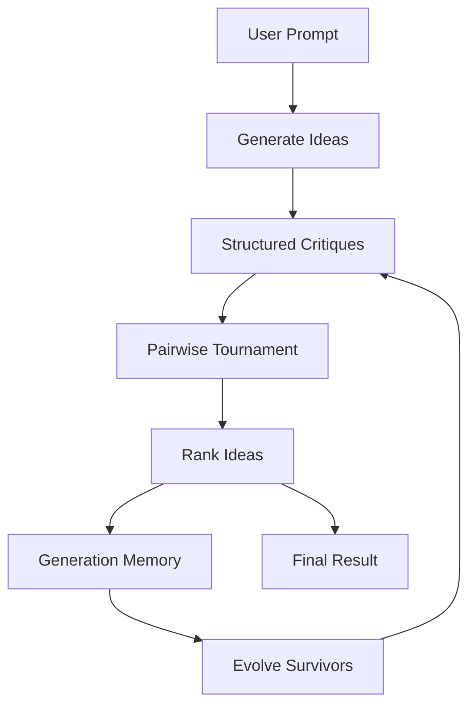




# Synapse

Synapse is a local multi-agent AI system where several small Ollama models work together to improve ideas instead of relying on one single answer.

You can think of it as an AI council. One group of local models generates ideas, critiques them, compares them in direct tournaments, evolves the strongest survivors, and repeats the process until Synapse produces a final answer.

## v0.2.1

Synapse v0.2.1 is a bugfix and output-quality pass.

Fixes:

- tournament winners are parsed only from a strict `WINNER:` line
- unclear tournament judgments are retried once, then skipped
- critiques use strict uppercase labels for more reliable parsing
- failed critique parsing preserves the raw critique instead of showing empty fields
- final results use a complete proposal structure
- evolution prompts ask survivors to preserve distinct approaches

## How It Works



The v0.2.0 loop is:

1. Generate one idea per available model.
2. Ask models for structured critiques.
3. Compare every idea against every other idea.
4. Record wins, losses, judge model, and reason.
5. Rank ideas by tournament performance.
6. Summarize generation memory.
7. Improve the strongest survivors.
8. Repeat for multiple generations.
9. Synthesize the final answer.

## Models

By default, Synapse uses:

- `qwen2.5:3b`
- `gemma2:2b`
- `llama3.2:3b`

You can edit these in `synapse/config.py`.

If a model is missing, Synapse prints a warning like:

```text
Warning: model llama3.2:3b is not installed. Run: ollama pull llama3.2:3b
```

Synapse will continue with the remaining installed models when possible.

## Requirements

Install Ollama:

https://ollama.com

Install Python dependencies:

```bash
pip install -r requirements.txt
```

Pull the default models:

```bash
ollama pull qwen2.5:3b
ollama pull gemma2:2b
ollama pull llama3.2:3b
```

## Usage

Run:

```bash
python synapse.py
```

Then enter a prompt.

Example:

```text
Design an AI system that designs better AI systems through competition.
```


## Output Modes

Synapse can print either a detailed trace or a simplified trace.

When you run the app, choose:

- `d` for detailed output: prints generated ideas, structured critiques, tournament results, rankings, memory, and final result.
- `s` for simplified output: prints a compact overview of each generation, including ideas, critique highlights, tournament count, winners, win/loss scores, survivors, memory, and final result.

Code can also call:

```python
run_council(topic, simplified=True)
```

## Project Structure

```text
Synapse/
    synapse.py
    requirements.txt
    README.md
    CHANGELOG.md
    synapse/
        __init__.py
        config.py
        core.py
        models.py
        generation.py
        critique.py
        tournament.py
        evolution.py
        memory.py
        prompts.py
        ideas.py
        output.py
        utils.py
    docs/
        SYNAPSE_BRAIN.md
        PROJECT_HISTORY.md
        ROADMAP.md
```

## Best Use Cases

Synapse works best for open-ended prompts:

- startup ideas
- game concepts
- product concepts
- design problems
- research directions
- self-improving AI system designs

It is less useful for simple factual questions because its strength comes from critique, comparison, and evolution.

## Notes

Synapse is experimental. Results depend heavily on your installed models, hardware, prompts, and generation settings. The point is to explore whether structured disagreement between local models can produce better answers than a single first response.

## Developer Checks

Run a syntax check:

```bash
python -m compileall .
```

The project intentionally does not require a test framework yet. Parser checks can be run with small direct Python assertions while the codebase is still compact.

## Examples

**For a better comparison towards 0.1.0 we are using the same prompts as before.**

Prompts:
- Create a startup idea for AI that solves a real daily student problem. It must be realistic with current or near-future tech.
- Design a system to reduce food waste in school cafeterias without using any artificial intelligence. It should be realistic, low-cost, and usable in real schools today.
- Design a developer tool that sits inside a code editor and improves code quality in real time (linting, bug detection, refactoring suggestions). Describe its architecture, how it processes code, and what makes it different from existing tools.
- Design a self-improving AI system that learns from its own mistakes when generating ideas, without retraining the underlying model. It should evolve its decision-making process over time using feedback loops.

### Output 1

#### Final System Name:
**LearnWell**

#### Core Concept:
The LearnWell platform is designed as a comprehensive, AI-driven solution that addresses the multifaceted needs of students in real time while ensuring their well-being and productivity are not compromised. It integrates advanced learning analytics with robust human interaction to provide personalized support for academic challenges and mental health issues. The system aims to create a supportive ecosystem where students can thrive both academically and emotionally.

### Output 2

#### 1. Final System Name
**School Eats Smart & Wasteless System**

#### 2. Core Concept
The **School Eats Smart & Wasteless System** is an innovative, realistic, and low-cost solution to reduce food waste in school cafeterias. It combines existing technology with user-friendly strategies to provide a comprehensive approach that can be easily implemented without significant upfront investments or complex infrastructure changes.

### Output 3

#### **1. Final System Name**
NextGen Code Enforcer

#### **2. Core Concept**
NextGen Code Enforcer is a comprehensive developer tool designed to sit inside a code editor and offer real-time feedback on code quality, performance, and security in real time (linting, bug detection, refactoring suggestions). By leveraging advanced machine learning models fine-tuned with proprietary data and integrating seamlessly with Visual Studio Code (VSCode), this system aims to provide developers with faster and more accurate insights that significantly enhance productivity. The tool includes automated refactorings and supports a flexible feedback model for optimal user experience.

### Full System Output Example


**NOTE**
- The Outputs (except for the Full System Output Example) given are only the conclusion or overview paragraphs taken from the original output along with the title
- All Outputs given (including the Full System Output Example) were generated using the simplified mode.
- These prompts were given to, and outputs generated by, the following models:
```
- `qwen2.5:3b`
- `gemma2:2b`
- `llama3.2:3b`
```

## License

Synapse is licensed under the Business Source License 1.1.

You may use Synapse for personal use, testing, research, education, learning, evaluation, and non-commercial experimentation.

Commercial production use requires a separate written license from launchAxis until the Change Date listed in the LICENSE file.

If Synapse is used to power a user-facing application under the non-commercial Additional Use Grant, the application must include:

> Powered by Synapse (launchAxis)

Applications using Synapse are also encouraged, but not required, to include a more visible link or badge such as:

> Powered by Synapse by launchAxis

On the Change Date, Synapse will become available under the Apache License 2.0.

