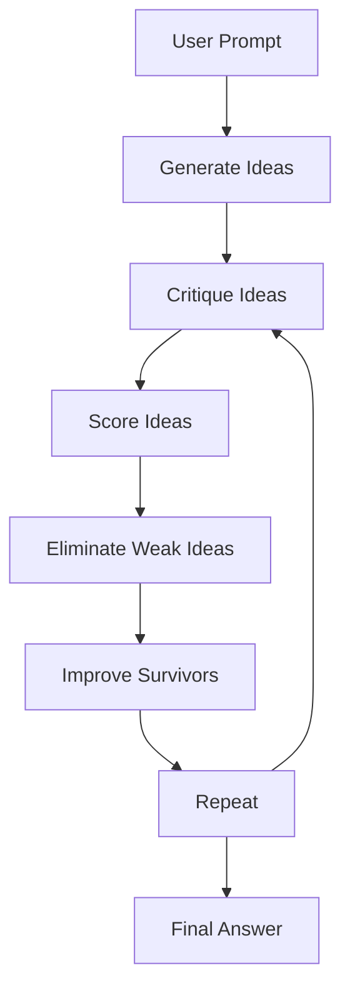

# Synapse

Synapse is a local multi-agent AI system where multiple small models work together to improve ideas instead of relying on a single answer.

Instead of asking one AI and stopping there, Synapse runs a structured process where different models generate, critique, score, and improve ideas until only the strongest one survives.

You could imagine it as a small “AI council” that argues with itself, refines ideas, and converges toward a final result.

---

## What it does

Synapse takes a prompt and runs it through an iterative system:

1. Each model generates its own idea
2. Every model critiques all ideas
3. Ideas are scored and weaker ones are removed
4. The surviving ideas are improved
5. The cycle repeats for multiple rounds
6. Eventually, one final idea remains
7. The final idea is polished into a response

There is also a final presentation phase where the winning idea is rewritten in different styles and the best version is selected.

---

## Why I made it

Most AI tools give a single answer and stop there.

I wanted to see what happens if you force multiple models to disagree, refine each other’s work, and gradually converge on something better.

It’s not meant to be a massive system or anything overhyped. Its basically just an experiment in collaborative reasoning between models running locally.

The project was built with help from ChatGPT, mainly to explore whether AI can be used to design better multi-AI systems.

---

## How it works



The system follows a simple loop:

- generate  
- critique  
- score  
- eliminate  
- improve  
- repeat  

At the end of the loop, the strongest idea is selected and returned as the final output.

---

## Models used

By default, Synapse uses Ollama with these models:

- `qwen2.5:3b`
- `gemma2:2b`
- `llama3.2:3b`

They’re small enough to run on a normal laptop but different enough to produce varied opinions during critique and generation.

You can swap them out anytime in the config section.

---

## Requirements

You need Ollama installed first:

https://ollama.com

Then install Python dependencies:

```bash
pip install ollama
```

Then pull models:

```bash
ollama pull qwen2.5:3b
ollama pull gemma2:2b
ollama pull llama3.2:3b
```

---

## Usage

Run the script:

```bash
python synapse.py
```

Then enter a prompt when asked.

Example:

Create a startup idea for AI that solves a real daily student problem. It must be realistic with current or near-future tech.

---

## What it’s good for

Synapse works best for open-ended problems like:

- startup ideas
- game concepts
- product ideas
- creative systems
- design problems
- brainstorming research directions

It is less useful for simple factual questions since its strength comes from comparing and evolving ideas.

---

## Features

- multiple AI models working together
- structured critique and scoring system
- elimination + improvement loop
- optional hybrid ideas
- memory between runs (optional)
- Mermaid graph export
- prompt self-improvement (optional)
- fully local via Ollama

---

## Project structure

```
Synapse/
├── ai_council_evolution_system.py
├── README.md
├── LICENSE
├── .gitattributes
├── .gitignore
└── requirements.txt
```

Optional files generated at runtime:

```
ai_council_memory.json
idea_evolution.mmd
```

---

## Examples

Prompts:
- Create a startup idea for AI that solves a real daily student problem. It must be realistic with current or near-future tech.
- Design a system to reduce food waste in school cafeterias without using any artificial intelligence. It should be realistic, low-cost, and usable in real schools today.
- Design a developer tool that sits inside a code editor and improves code quality in real time (linting, bug detection, refactoring suggestions). Describe its architecture, how it processes code, and what makes it different from existing tools.
- Design a self-improving AI system that learns from its own mistakes when generating ideas, without retraining the underlying model. It should evolve its decision-making process over time using feedback loops.

### Output 1
**Academic Companion**

**Conclusion:**

The "Academic Companion" represents a revolutionary approach to academic support by harnessing cutting-edge AI technologies. By offering personalized study schedules, comprehensive progress tracking, real-time collaboration features, and immediate feedback mechanisms, this platform significantly enhances the efficiency and effectiveness of learning while alleviating the daily stress associated with managing multiple classes. It serves as an indispensable resource for students seeking to optimize their educational experience and academic performance in today's fast-paced digital environment.

### Output 2
**Final Idea: Comprehensive Inventory Management System**

**Overview**
Incorporating a comprehensive inventory management system into school cafeterias can significantly reduce food waste by optimizing ingredient usage and ensuring that supplies are used before they expire. This solution is practical, cost-effective, and easily deployable in existing kitchens.

### Output 3
**CodeCraft: The AI-Powered Graph-Based Code Dependency Analysis Tool**

**Conclusion**
CodeCraft revolutionizes code quality assurance by providing actionable insights through a graph-based approach to dependency analysis. This unique feature enables developers to improve modularity, reduce technical debt, and enhance overall code health in real-time. By embedding these capabilities directly into the development environment, CodeCraft empowers teams to deliver more maintainable and efficient software systems without sacrificing productivity or developer experience.

### Full System Output Example


**NOTE**
- The Outputs given are only the conclusion or overview paragraphs taken from the original output along with the title
- These prompts were given to, and outputs generated by, the following models:
```
- `qwen2.5:3b`
- `gemma2:2b`
- `llama3.2:3b`
```

## Notes

This is an experiment.

That means:

- results will vary depending on models
- some prompts will work better than others
- behavior may change as you tweak the system

That’s part of the point, it’s meant to be played with.

