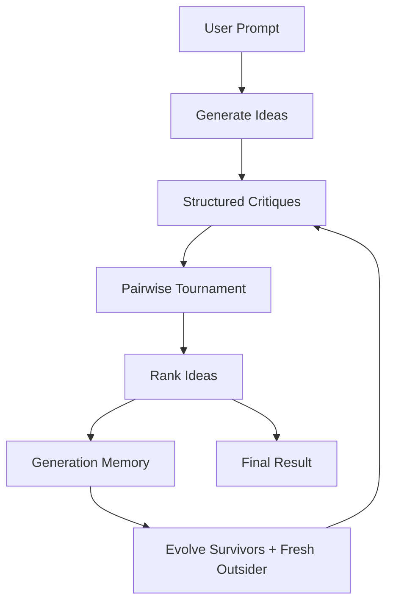

# Synapse

Synapse is a local multi-agent AI system where several small Ollama models work together to improve ideas instead of relying on one single answer.

You can think of it as an AI council. Models generate ideas, critique them, compare them in direct tournaments, evolve the strongest survivors, and repeat the process until Synapse produces a final answer.

Synapse is an experimental project developed with substantial help from ChatGPT and other AI coding tools. I built it as a hands-on way to explore local multi-agent AI systems and see what happens when small models generate, critique, compare, and evolve ideas. I hope you enjoy tinkering with it!


## v0.2.2

Synapse v0.2.2 is a hybrid reliability and inspectability release.

New in v0.2.2:

* topic-neutral final synthesis, so unrelated prompts no longer get forced into education, offline, or teacher-related sections
* CLI flags for scripted runs
* quiet, JSON, and developer output modes
* structured debug events
* JSON run export under `runs/`
* stronger model availability reporting
* markdown-tolerant strict tournament parsing
* controlled novelty injection during evolution
* pytest-based tests in `requirements-dev.txt`

## How It Works



The loop is:

1. Generate one idea per available model.
2. Ask models for structured critiques.
3. Compare every idea against every other idea.
4. Record wins, losses, judge model, and reason.
5. Rank ideas by tournament performance.
6. Summarize generation memory.
7. Improve survivors and add one fresh outsider idea.
8. Repeat for multiple generations.
9. Synthesize the final answer from the strongest evolved idea.

## Best Use Cases

Synapse works best for open-ended prompts where multiple perspectives, critique, comparison, and refinement are useful, such as:

* startup ideas
* game concepts
* product concepts
* design problems
* research directions
* software architecture ideas
* self-improving AI system designs

It is less useful for simple factual questions because its strength comes from structured disagreement, comparison, and evolution rather than quick retrieval.

## Requirements

Install Ollama:

https://ollama.com

Install runtime dependencies:

```bash
pip install -r requirements.txt
```

Install test dependencies:

```bash
pip install -r requirements-dev.txt
```

Pull the default models:

```bash
ollama pull qwen2.5:3b
ollama pull gemma2:2b
ollama pull llama3.2:3b
```

## Usage

Interactive mode:

```bash
python synapse.py
```

Scripted mode:

```bash
python synapse.py --prompt "Design a better note-taking app" --mode simplified
```

Useful flags:

```bash
python synapse.py --version
python synapse.py --models
python synapse.py --prompt "Design a better note-taking app" --mode quiet
python synapse.py --prompt "Design a better note-taking app" --mode json
python synapse.py --prompt "Design a better note-taking app" --mode dev --save-run
python synapse.py --prompt "Design a better note-taking app" --generations 2 --survivors 2
```

Output modes:

* `detailed`: full readable trace
* `simplified`: compact generation summaries
* `quiet`: prints only the final answer with minimal terminal output
* `json`: prints only the full `RunResult` JSON
* `dev`: simplified trace plus debug events and model notes

Save a run:

```bash
python synapse.py --prompt "Design a better note-taking app" --save-run
```

Synapse writes:

```text
runs/YYYY-MM-DD_HH-MM-SS_slug/
  run.json
  final_answer.md
  debug_log.txt
```

## Models

By default, Synapse uses:

* `qwen2.5:3b`
* `gemma2:2b`
* `llama3.2:3b`

You can edit these in `synapse/config.py`. See `docs/CONFIG_GUIDE.md` for the main settings.

If a model is missing, Synapse reports the missing model, shows available models when Ollama provides them, and continues with remaining configured models when possible.

## Project Structure

```text
Synapse/
  synapse.py
  requirements.txt
  requirements-dev.txt
  README.md
  CHANGELOG.md
  LICENSE
  synapse/
    __init__.py
    config.py
    core.py
    models.py
    generation.py
    critique.py
    tournament.py
    evolution.py
    memory.py
    prompts.py
    ideas.py
    output.py
    export.py
    utils.py
  docs/
    CONFIG_GUIDE.md
    SYNAPSE_BRAIN.md
    PROJECT_HISTORY.md
    ROADMAP.md
  tests/
```

## Examples

### Basic idea-generation run

```bash
python synapse.py --prompt "Design an AI system that designs better AI systems through competition." --mode simplified
```

This runs Synapse in a compact mode and prints generation summaries, critiques, tournament results, survivors, memory, and the final answer.

### JSON output

```bash
python synapse.py --prompt "Design a peaceful steampunk space strategy game inspired by Master of Orion, focused on exploration, diplomacy, ancient ruins, and non-lethal robot battles." --mode json
```

This prints the full structured `RunResult` as JSON, including generated ideas, critiques, comparisons, rankings, debug events, and the final answer.

### Developer mode with saved run

```bash
python synapse.py --prompt "Design a better note-taking app for students and researchers." --mode dev --save-run
```

This prints a developer-friendly trace and saves the full run under `runs/`, including:

```text
run.json
final_answer.md
debug_log.txt
```

### Good prompts to try

Synapse works best with open-ended prompts where different models can generate, critique, compare, and evolve ideas.

Try prompts like:

```text
Design a self-improving AI system that learns from its own mistakes without retraining the underlying model.

Create a startup idea for AI that solves a real daily problem, using current or near-future technology.

Design a developer tool that sits inside a code editor and improves code quality in real time.

Design a peaceful space strategy game focused on exploration, diplomacy, ancient ruins, and non-lethal conflict.

Create a low-cost system to reduce food waste in school cafeterias without using artificial intelligence.
```

### Example output style

Synapse outputs vary depending on the models, prompt, and settings. A typical run includes:

```text
Generation 0
- Initial ideas from each available model
- Structured critiques
- Pairwise tournament comparisons
- Ranked survivors

Generation 1+
- Improved survivor ideas
- Fresh outsider idea
- New critiques and comparisons
- Updated generation memory

Final Result
- Synthesized answer based on the strongest evolved idea
```

## Developer Checks

Run a syntax check:

```bash
python -m compileall .
```

Run the test suite:

```bash
python -m pytest
```

## Current Scope

Synapse v0.2.2 intentionally keeps the runtime lightweight and local-first.

Included in this release:

* local Ollama model orchestration
* CLI usage
* JSON output mode
* JSON run export
* debug/dev output mode
* controlled novelty injection
* stricter parser behavior
* pytest-based development checks

Intentionally postponed:

* full Rich split-screen UI
* persistent cross-run memory
* real model-to-model dialogue
* concurrency
* Pydantic structured outputs
* cloud APIs
* agentic terminal app / coding-assistant style interface
* LoRA or model-weight training

## Notes

Synapse is experimental. Results depend heavily on installed models, hardware, prompts, and generation settings.

Developer mode shows visible model outputs, model notes, debug events, and system decisions. It does not show hidden private model reasoning.

Actual examples are included in text at docs/examples_FULL.txt

## License

Synapse is licensed under the Business Source License 1.1.

You may use Synapse for personal use, testing, research, education, learning, evaluation, and non-commercial experimentation.

Commercial production use requires a separate written license from launchAxis until the Change Date listed in the LICENSE file.

If Synapse is used to power a user-facing application under the non-commercial Additional Use Grant, the application is encouraged to include:

> Powered by Synapse (launchAxis)

Applications using Synapse are also encouraged, but not required, to include a more visible link or badge such as:

> Powered by Synapse by launchAxis

On the Change Date, Synapse will become available under the Apache License 2.0.
